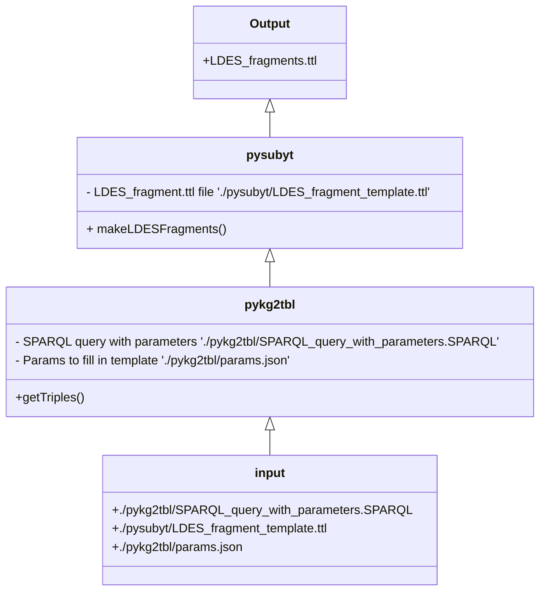

# BODC LDES Demo documentation

This repository contains the documentation for the BODC LDES Demo.

## Requirements and technologies used

The python script used in this project requires Python 3.X.
To install the required dependencies, run the following command:

```bash
pip install -r requirements.txt
```

## Usage

To run the script, run the following command:

```bash
python BODC_LDES_Demo.py
```

## Diagram of BODC LDES Demo

The python file can be broken down into the following components:

- ###### Input : 
    - ```./pykg2tbl/SPARQL_query_with_parameters.SPARQL```:
        SPARQL file with parameters to be filled in by ```./pykg2tbl/params.json```
    - ```./pykg2tbl/params.json```:
        Parameters to be filled in ```./pykg2tbl/SPARQL_query_with_parameters.SPARQL```
    - ```./pysubyt/LDES_fragment_template.ttl```:
        ttl file that will be populated by the output of the SPARQL query

- ###### pykg2tbl
    - getTriples():
        - Runs the SPARQL query with the parameters in ```./pykg2tbl/params.json```
        - Returns the output of the SPARQL query as a list of triples

- ###### pysubyt
    - makeLDESFragments():
        - Takes the list of triples from pykg2tbl.getTriples() and populates the ```./pysubyt/LDES_fragment_template.ttl``` file
        - Returns the populated ```./pysubyt/LDES_fragment_template.ttl``` file
- ###### Output
    - LDES_fragments.ttl:
        - The output of the script, a populated ```./pysubyt/LDES_fragment_template.ttl``` file



